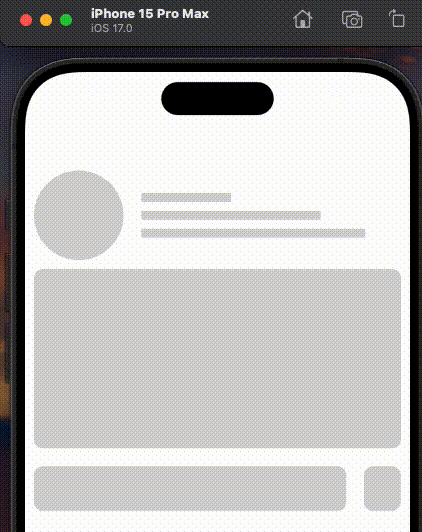

# react-native-masked-skeleton

This library exposes a cross-platform interface for Skeleton Loader.

Under the hood, this library is using [`@react-native-masked-view/masked-view`](https://github.com/react-native-masked-view/masked-view), 
[`expo-linear-gradient`](https://www.npmjs.com/package/expo-linear-gradient) and [`react-native-reanimated`](https://github.com/software-mansion/react-native-reanimated).

## Example


## Setup
```bash
# using npm
$ npm i react-native-masked-skeleton

# using yarn
$ yarn add react-native-masked-skeleton
```

## Usage
```javascript
import React, { useState } from "react";
```

## MaskedSkeleton props
| Name            | Type       | Default          | Required  | Description           | Supported Values |
| --------------- | ---------- | ---------------- | --------  | --------------------  |      -           |
| `maskElement`   | number     |     -            | required  | Animation Duration    |      -           |
| `colors`        | string[]   |     -            | required  | Gradient Color        |      -           |
| `delay`         | number     | `500`            | optional  | Animation Delay       |      -           |
| `duration`      | number     | `2000`           | optional  | Animation Duration    |      -           |
| `direction`     | string     | `leftToRight`    | optional  | Animation Direction   | `leftToRight` `rightToLeft` `topToBottom` `bottomToTop` |

## Skeleton props
Skeleton Supports all React Native [View](https://reactnative.dev/docs/view) Props
